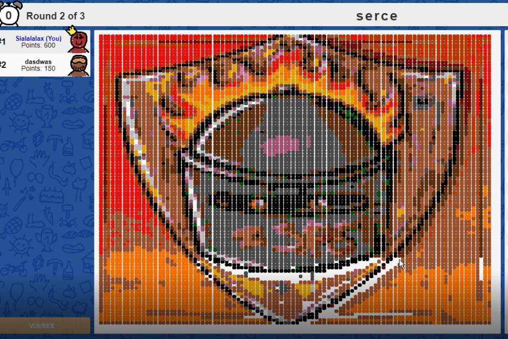

# Scribbl.io bot
Program that automatically recreates given image in scribbl.io game.

It may not work correctly due to difference in scribbl.io painting tools positions on different screens.
You can use `coordinates.py` to find correct coordinates values for your screen.

The program is quite provisional and could be improved by me in the future.

## Examples

