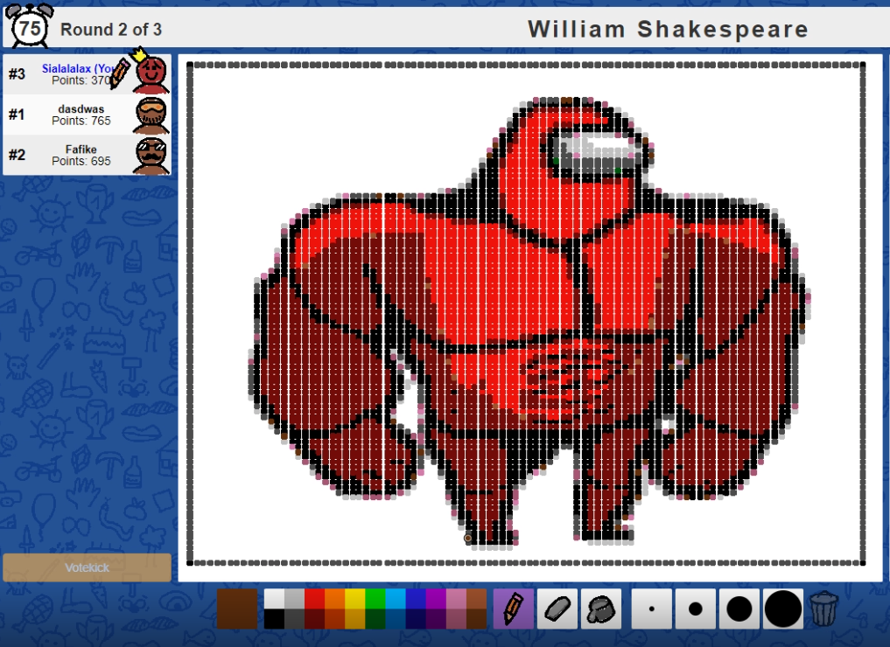

# "Scribbl.io bot"
Simple program that automatically recreates given image in scribbl.io game.

It may not work correctly due to difference in scribbl.io painting tools positions on different screens. `coordinates.py` is to help finding correct coordinates values.
The program is quite provisional and could be improved by me in the future.

### Example

For more examples see `examples` directory.
